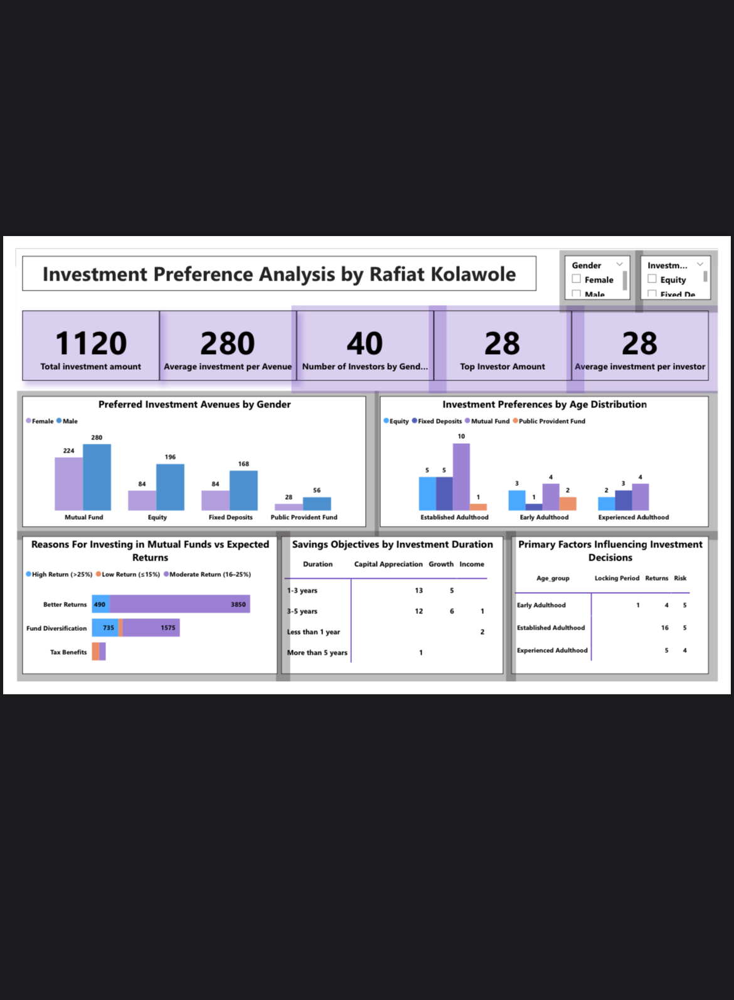

# Investor Behavior and Investment Preferences Analysis

## Project Overview
This project analyzes investor behavior to understand how individuals make investment decisions across different financial instruments, including Mutual Funds, Equity, Fixed Deposits, and Public Provident Fund (PPF).

The analysis explores how demographic factors, risk tolerance, and investment horizons influence investment choices and financial goals.

## Tools Used
- Power BI
- Data Cleaning & Preparation
- Data Analysis
- Data Visualization

## Objectives
- Identify preferred investment avenues among investors
- Analyze how age and gender influence investment decisions
- Examine investor expectations regarding risk and returns
- Understand how investment duration shapes financial goals

## Key Insights
- Mutual Funds emerged as the most preferred investment option due to their balance of risk and returns
- Investment choices varied by age and gender, with younger investors focusing more on returns and older investors prioritizing stability
- Most investors expected moderate to high returns rather than extremely high-risk gains
- Short-term investors focused on income generation, while long-term investors prioritized capital appreciation and wealth growth

## Conclusion
The analysis shows that investment behavior evolves with life stage, risk appetite, and financial objectives. Understanding these patterns can help investors and financial professionals make more informed and targeted investment decisions.

## Dashboard Preview
## Dashboard Preview

